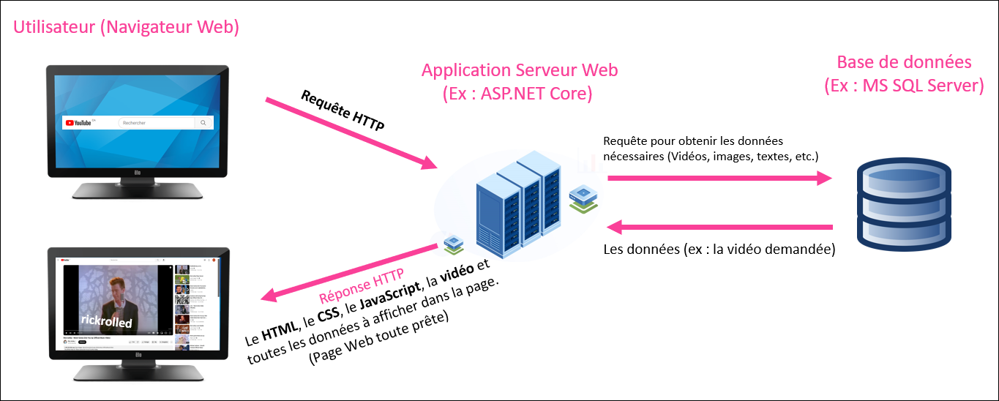
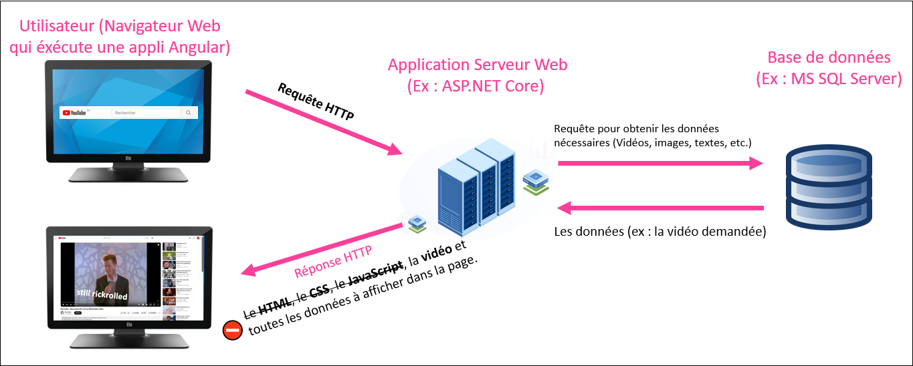
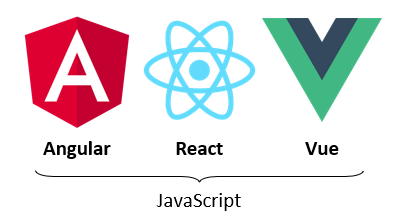

# Cours 1 - Intro à Angular

### Application Web ASP.NET Core <u>sans</u> client Angular

Quand on envoie une requête HTTP au serveur sur lequel l'application ASP.NET Core roule, le serveur 
nous renvoie du **HTML**, du **CSS** et du **JavaScript** pour que la page Web à afficher chez
l'utilisateur soit toute prête. 🎁👌



### Application Web ASP.NET Core <u>avec</u> client Angular

Désormais, il y a une application Web cliente (c'est-à-dire qu'elle est exécutée sur l'ordinateur de 
l'utilisateur) qui contient tout le HTML, le CSS et le JavaScript du site Web visité.

Quand on envoie une requête HTTP au serveur sur lequel l'application ASP.NET Core roule, le serveur
nous renvoie seulement les données à afficher (vidéos, images, morceaux de texte, etc.) sous forme 
de JSON ou de XML et l'application Angular s'occupera de « pluguer » les données dans le HTML. 📦🔍



Pour que le navigateur de l'utilisateur ait accès au client Angular, le serveur doit lui envoyer le
projet Angular compilé en entier lorsque l'utilisateur fait sa première requête au site Web.

Par exemple, lorsque je souhaite naviguer sur YouTube, voici ce qu'il se passe, grossièrement :

1. J'envoie ma **première requête HTTP** (`https://www.youtube.ca`) à YouTube.
2. L'application Web serveur de YouTube me retourne les choses suivantes :

    * ⚙ Une application Angular compilée (inclut tous le **HTML**, le **CSS** et le **JavaScript** du site Web)
    * 📦 Les **données** à afficher sur la page d'accueil du site Web (Quelques thumbnails de vidéo, les titres des vidéos, etc.)

3. Ma navigation se poursuit. Par exemple, je clique sur une vidéo. (Ce qui envoie une **deuxième requête HTTP** à Youtube : `https://www.youtube.com/watch?v=dQw4w9WgXcQ`)
4. L'application Web serveur de YouTube me retourne des **données** supplémentaires :

    * 🎥 La vidéo à visionner.
    * 📃 Le titre de la vidéo.
    * 📜 Les commentaires de la vidéo.
    * etc.

### 🎭 Différences avec / sans une application Web cliente

| Aspect | Avec Angular | Sans Angular |
| - | - | - |
| 🏁 Première requête à un site Web | Recevoir l'application cliente Angular compilée en entier. **Plus long** pour charger la page d'accueil. | Recevoir un peu de HTML, de CSS et de JavaScript. |
| 🚩 Requêtes suivantes | Recevoir seulement les nouvelles données à intégrer à la page Web. **Plus court**. | Recevoir le HTML, le CSS et le JavaScript de la nouvelle page Web. |
| ⚡ Charge du serveur | Allégée : il n'a plus besoin de construire les pages Web. (Les views) | Alourdie : il doit construire chaque page Web avant de les envoyer. |
| 🖥 Charge du client | Alourdie : il y a plus de JavaScript qui travaille côté client pour faire évoluer les pages Web dynamiquement. | Allégée : les pages Web arrivent toutes faites. Il y a parfois un peu de JavaScript pour rendre les pages Web dynamiques, mais c'est léger. |
| 📱🖥💻 Portabilité | Flexible : le serveur Web retourne des données sous format JSON / XML ! On pourrait créer une application mobile qui envoie des requêtes au même serveur Web sans problème. | Rigide : Le serveur retourne du HTML, du CSS et du JavaScript... Il faut utiliser la page Web tel quel. |

:::tip

Bien qu'utiliser un framework client comme Angular offre plusieurs avantages pour un site Web dont le contenu est très dynamique, 
pour des sites Web simples et très statiques, (blogs, journaux, recettes, etc.) se passer d'une application cliente est raisonnable.
On pourrait même aller plus loin et simplement utiliser un CMS (Content Management System) comme Wordpress pour ne pas avoir à écrire
la moindre ligne de code.

:::

### 🐟 Autres frameworks

#### ⚙ Frameworks serveurs

Depuis votre premier cours de Web, vous utilisez le framework **ASP.NET Core** pour créer des applications Web **serveur**.
Il existe d'autres frameworks Web serveurs (_back end_) qui peuvent jouer le même rôle. Ils sont généralement similaires,
avec quelques fonctionnalités, avantages et défis différents.

Comme ce type de projet ne roule pas dans un navigateur Web, n'importe quel langage de programmation peut être utilisé.

<center></center>

#### 🖥 Frameworks clients

Dans ce cours, nous apprendrons à utiliser le framework **Angular** pour créer des applications Web **cliente**.
Il existe d'autres frameworks Web clients (_front end_) également.

Comme ce type de projet roule dans le navigateur Web de l'utilisateur, JavaScript est un choix relativement obligatoire.

<center></center>

:::warning

Pourquoi ne pas communiquer directement avec la base de données avec un framework client comme Angular ? (Et se passer
d'un framework serveur comme ASP.NET Core) Le projet Angular est envoyé en entier au client et il n'est donc pas du tout
sécuritaire d'interagir avec une base de données dans une application cliente. (L'utilisateur aura accès aux identifiants
de connexion à la base de données et aux requêtes SQL)

:::

### 🛠 Outils à installer (à la maison seulement ! 🏠)

⛔ Ces outils sont déjà installés à l'école.

#### NPM
<center></center>

Gestionnaire de paquets 📦 pour JavaScript. Nous aidera à gérer les dépendances pour nos projets Angular.  
Installez simplement [Node.js](https://nodejs.org/fr/), qui inclut NPM. Utilisez les paramètres par défaut lors de l'installation. Pas besoin d'installer Chocolatey.

<center></center>

Pour vérifier que NPM est bien installé, ouvrez **PowerShell**  
<center></center>
...et tapez simplement la commande `npm`, qui devrait vous proposer de l'aide pour taper d'autres commandes npm.

#### Angular
<center></center>

Tapez simplement la commande `npm install -g @angular/cli@18.1.2`. (Toujours dans PowerShell) On précise la version `18.1.2` car c'est la même que celle installée au Cégep, ce qui évite des conflits.
N'hésitez pas à ensuite taper la commande `ng version` pour valider qu'Angular s'est bien installé globalement.

### 🧪 Introduction à TypeScript
<center></center>

**TypeScript** est le langage que nous utiliserons (en plus de HTML et CSS) pour travailler sur nos projets Angular. L'extension des fichiers TypeScript est **.ts**.

:::info

Un instant ! **JavaScript** n'est-il pas le seul langage qui peut être interprété par les navigateurs Web ?
Oui, c'est exact. **TypeScript** n'est pas un _vrai langage_. C'est un _superset_ (Dérivé avec plus de contenu)
de **JavaScript**. Lorsque du code **TypeScript** est compilé, il est secrètement converti en **JavaScript** pour être
interprété par le navigateur Web. Pourquoi ne pas directement coder en **JavaScript** alors ? Car **TypeScript** nous apportera
plusieurs avantages importants et quelques fonctionnalités supplémentaires. 

:::

#### Exemple en JavaScript

Cela ressemble assez à **C#** pour que vous puissiez déduire le comportement de ce code.

```js showLineNumbers
function printToConsole(m){
    console.log(m);
}

let message = "Please send";
let n = 5;

message = 5 < 4 ? "Pick a Shoe" : message + " dudes";

for(let i = 0; i < n; i++){
    if(n % 2 == 0){
        printToConsole(message);
    }
}
```

import Tabs from '@theme/Tabs';
import TabItem from '@theme/TabItem';

#### TypeScript VS JavaScript

Voici le même exemple de code, dans les deux langages :

<Tabs>
    <TabItem value="js" label="JavaScript" default>
        ```js showLineNumbers
        multiplyByTwo(n){
            let newValue = n * 2;
            return newValue;
        }
        ```
    </TabItem>
    <TabItem value="ts" label="TypeScript" default>
        ```ts showLineNumbers
        multiplyByTwo(n : number) : number {
            let newValue : number = n * 2;
            return newValue;
        }
        ```
    </TabItem>
</Tabs>

On remarque surtout le typage dans l'exemple en **TypeScript** :
* Le paramètre de la fonction est typé.
* Le paramètre de retour est typé.
* La variable locale newValue est typée.

:::note

Les langages typés (C#, Java, TypeScript, C++, etc.) permettent généralement d'avoir moins d'erreurs lors de l'exécution du code. 
(Les erreurs sont détectées par le compilateur) Les langages non typés (JavaScript, Python, Ruby, etc.) ont plus de chances de
générer des erreurs lors de l'exécution. (Les erreurs ne sont pas détectées à la compilation)

:::

<center>
      
    Oups ! "sus" multiplié par 2 ne donne pas une donnée valide...
</center>

### 🧰 Classes, variables et fonctions en TypeScript

Exemple de classe simple ඞ :

```ts showLineNumbers
class Crewmate{

    // Propriétés de la classe (publiques par défaut)
    impostor : boolean;
    alive : boolean;

    // Constructeur
    constructor(public color : string, public playerName : string){
        this.impostor = Math.random() < 0.5;
        this.alive = true;
    }

    // Fonction quelconque
    kill() : void{
        console.log(this.playerName + (this.impostor ? " was an impostor" : " was not an impostor"));
        this.alive = false;
    }

}
```

#### Propriétés de classe

* Doivent être typées `impostor : boolean` ou initialisées immédiatement `impostor = false`, au choix. (On peut faire les deux également)
* Peuvent posséder plusieurs types au besoin : `color : string | null` (Cette variable pourrait être `= "blue"` ou encore `= null`)
* Peuvent être undefined à l'aide de `?` : `playerName ?: string` ou carrément `playerName : string | undefined`.
* Pour les utiliser dans une fonction, il faut obligatoirement utiliser le préfixe `this`.

```ts showLineNumbers
class SkibidiCar{

    // Propriétés
    brand : string;
    isNew : boolean = true;
    year : number | null = null;
    driverName ?: string;

    // Constructeur
    ...

}
```

* **brand** : Devra obligatoirement être initialisée avec une chaîne de caractères par le constructeur.
* **isNew** : Initialisée avec true par défaut, mais pourrait être remplie avec `true` / `false` ailleurs.
* **year** : Initialisée avec null par défaut, mais pourrait être remplie avec un nombre ailleurs.
* **driverName** : Pourra être remplie avec une chaîne de caractères ailleurs. (Peut aussi rester `undefined` / vide)

:::note

Les types que nous utiliserons le plus en TypeScript seront `boolean`, `null`, `undefined` (ou `?:` devant le type), `number` (Remplace float, int, etc.) et `string`.

:::

#### Constructeurs

Si un paramètre du constructeur possède le préfixe `public`, ce paramètre devient automatiquement une propriété de classe.

```ts showLineNumbers
class Crewmate{

    impostor : boolean;
    alive : boolean = true;

    constructor(public color : string){
        this.impostor = Math.random() < 0.5;
    }

}
```

Ci-dessus, la classe `Impostor` possède donc 3 propriétés : impostor, alive et **color.** 
De plus, la valeur passée en paramètre au constructeur pour color est automatiquement assignée à la propriété color.

```ts showLineNumbers
// Cet imposteur aura "red" comme valeur pour sa propriété color
let impostor : Impostor = new Impostor("red");
```

Si ce n'est pas clair, voici deux classes dont le fonctionnement et les propriétés sont **identiques** :

<Tabs>
    <TabItem value="no_prefix" label="Sans le préfixe public" default>
        ```js showLineNumbers
        class Cat{

            name : string;
            color : string;

            constructor(name : string, color : string){
                this.name = name;
                this.color = color;
            }

        }
        ```
    </TabItem>
    <TabItem value="prefix" label="Avec le préfixe public" default>
        ```ts showLineNumbers
        class Cat{

            constructor(public name : string, public color : string){}

        }
        ```
    </TabItem>
</Tabs>

#### Fonctions de classe

* Pas obligé de préciser le type de retour, mais c'est souhaitable pour éviter des erreurs.
* Il est obligatoire de préciser le type des paramètres.
* N'oubliez pas le préfixe `this` lorsque vous faites référence à une propriété de classe.
* Il est possible de déclarer des variables locales à l'aide du mot-clé `let`.

```ts showLineNumbers
playWithToy(toyName : string) : string {
    let msg : string = this.catName + " joue avec " + toyName;
    return msg;
}
```